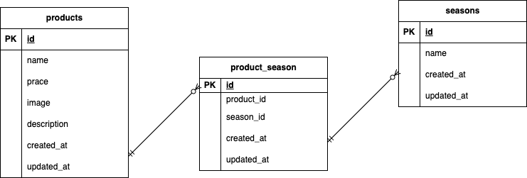

# second-check-test

環境構築

Dockerビルド
・git clone https://github.com/tomoe-takei/second-check-test
・docker-compose up -d --build

Laravel環境構築
・docker-compose exec php bash
・cp .env.example .env
・composer install
・php artisan key:generate
・php artisan migrate
・php artisan db:seed

使用技術
・PHP 8.1-fpm
・Laravel 8.75
・MySQL 8.0.26
・nginx:1.21.1

ER図

